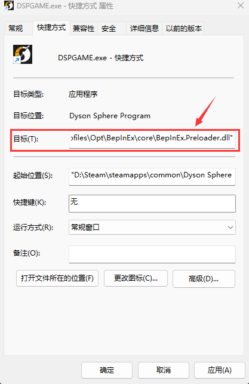

+++
title = '【戴森球计划】Steam版带mod多开教程'
date = 2023-12-25T18:53:12+08:00
draft = false
isCJKLanguage = true
+++
# 前言
* 本文旨在介绍使用r2modman管理mod的前提下，让Steam版戴森球计划多开的方法
* 此方法也可以用于在不开启r2modman的情况下带mod启动游戏
<!--more-->

# 一、安装r2modman用于管理游戏mod
1. 对于安装和使用r2modman，请移步[此处](https://www.bilibili.com/read/cv26835751/)观看[TTenYX大佬](https://space.bilibili.com/630071255/)完整的安装和使用教程
2. 因为r2社区的 BepInEx 版本比较低，可能在我们之后的启动方式下和部分使用了较高级的补丁功能的mod有兼容性问题，所以要手动升级一下 BepInEx:
    + 从[这里](https://github.com/bepinex/bepinex/releases/latest)下载最新版的BepInEx(注意下载BepInEx_x64_开头的64位版本)
        - 注意：如果访问有困难，可以用[这个地址](https://mirror.ghproxy.com/github.com/BepInEx/BepInEx/releases/download/v5.4.22/BepInEx_x64_5.4.22.0.zip)直接下载文件(注意这里是5.4.22版本，以后如果有更新可以更换为新的版本号)
    + 在r2modman的`Settings`里点击`Browse profile folder`，将下载的新版本zip解压覆盖到打开的目录内
        - 注意：对每个profile都要做一下这个步骤
        - (可选) 如果还有问题，那么将新版本里的winhttp.dll复制到游戏安装目录(怎样找到游戏安装目录请参见第二部分)覆盖老版本的winhttp.dll

# 二、修改游戏配置文件
1. 从Steam里定位到游戏安装目录，找到`DSPGAME_Data\boot.config`这个文件
2. 用文本编辑器打开，在`single-instance=`这一行前面加个`#`号
    + 注意如果做过校验文件完整性或者游戏更新过以后，可能要重新修改这个文件

# 三、创建多开用的快捷方式
1. 在r2modman的`Settings`里找到`Set launch parameters`并点击
2. 在弹出的窗口中可以看到`Modded:`下面是一串启动参数，我们把它复制下来
3. 右键点击戴森球安装目录里的DSPGAME.exe然后在右键菜单里点`创建快捷方式`
4. 右键点击创建出来的快捷方式，在右键菜单里点`属性`
5. 在属性窗口里，目标的输入框最后添加之前第2步复制的启动参数并点击`确定`关闭窗口
6. 在此目录下创建一个steam_appid.txt，里面写上1366540
7. 现在这个快捷方式就可以用于多开带有对应mod列表的戴森球计划游戏了，并且你还可以为r2modman不同的profile创建不同的快捷方式
    + 快捷方式可以被移动到任何位置，不影响他们的正常使用，建议移动到桌面以方便使用

以上就是本教程的全部内容，祝大家游戏愉快！
