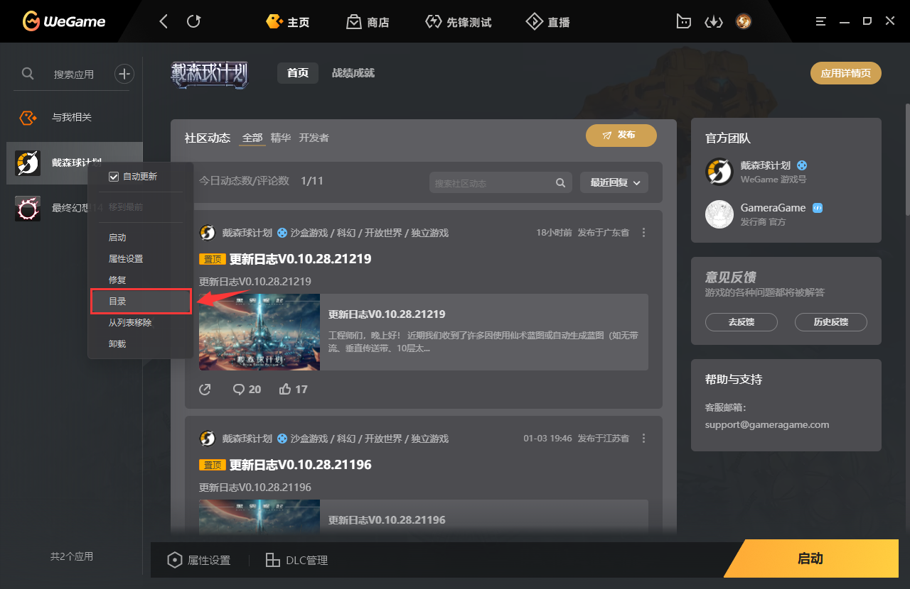
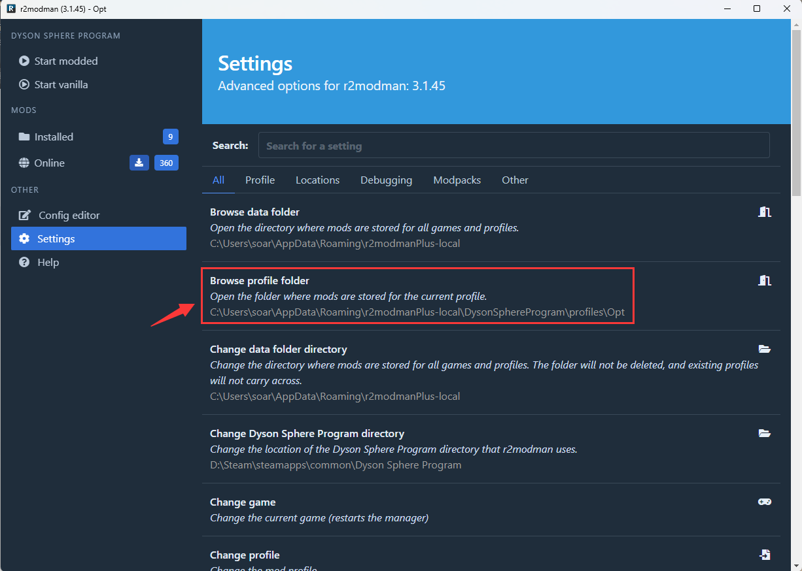
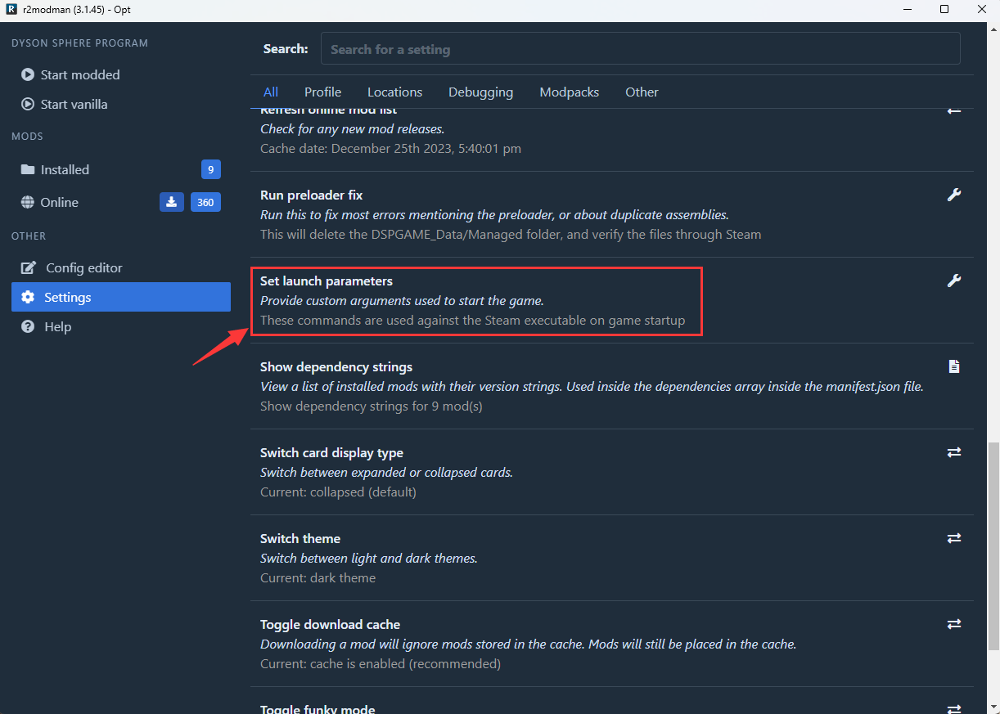
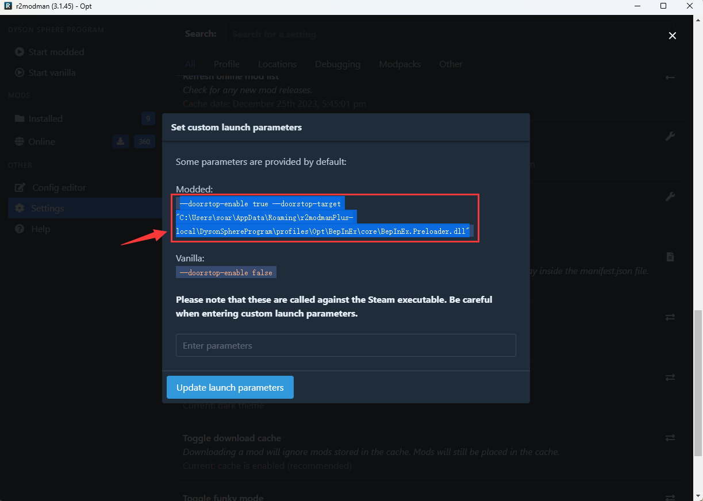
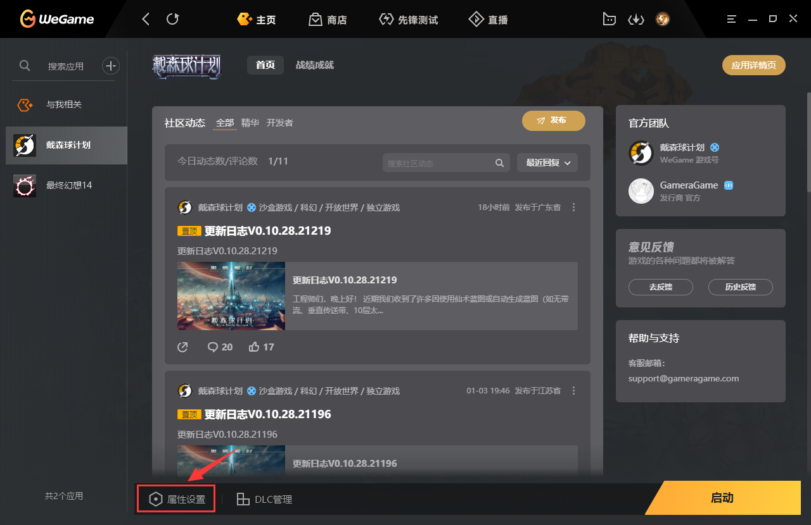
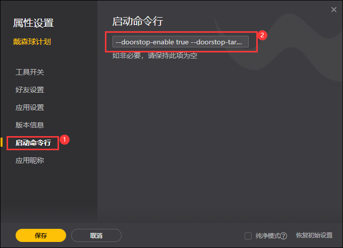

+++
title = '【戴森球计划】用r2modman管理WeGame版戴森球的mod'
date = 2024-01-05T15:58:38+08:00
draft = false
isCJKLanguage = true
+++
# 前言
* 本文介绍用r2modman管理mod的前提下，如何支持WeGame版戴森球计划带mod启动游戏
<!--more-->

# 一、安装r2modman用于管理游戏mod
1. 对于安装和使用r2modman，请移步[此处](https://www.bilibili.com/read/cv26835751/)观看[TTenYX大佬](https://space.bilibili.com/630071255/)完整的安装和使用教程
2. 安装doorstop到游戏安装目录
    + 从WeGame里定位到游戏安装目录
    + 在r2modman的`Settings`里点击`Browse profile folder`，将此目录内的winhttp.dll复制到上一步打开的游戏安装目录内
3. (可选) 如果因为r2社区的 BepInEx 版本比较低，导致该启动方式下和部分使用了较高级的补丁功能的mod有兼容性问题的话，可以尝试手动升级一下 BepInEx:
    + 从[这里](https://github.com/bepinex/bepinex/releases/latest)下载最新版的BepInEx(注意下载BepInEx_x64_开头的64位版本)
        - 注意：如果访问有困难，可以用[这个地址](https://mirror.ghproxy.com/github.com/BepInEx/BepInEx/releases/download/v5.4.22/BepInEx_x64_5.4.22.0.zip)直接下载文件(注意这里是5.4.22版本，以后如果有更新可以更换为新的版本号)
    + 在r2modman的`Settings`里点击`Browse profile folder`，将下载的新版本zip解压覆盖到打开的目录内
        - 注意：对每个profile都要做一下这个步骤
        - (可选) 如果还有问题，那么将新版本里的winhttp.dll复制到游戏安装目录覆盖老版本的winhttp.dll

# 二、修改游戏启动选项
1. 在r2modman的`Settings`里找到`Set launch parameters`并点击
2. 在弹出的窗口中可以看到`Modded:`下面是一串启动参数，我们把它复制下来
3. 在WeGame里打开戴森球计划的游戏页面，点击左下角的属性设置
4. 然后在弹出的窗口点击左边的启动命令行(①)，在右边的输入框(②)复制进之前第2步的启动参数并点击保存关闭窗口
5. 此时再启动游戏即可带mod启动戴森球，注意：如果要使用不同的profile要重复以上1-4的步骤修改启动选项

以上就是本教程的全部内容，祝大家游戏愉快！
