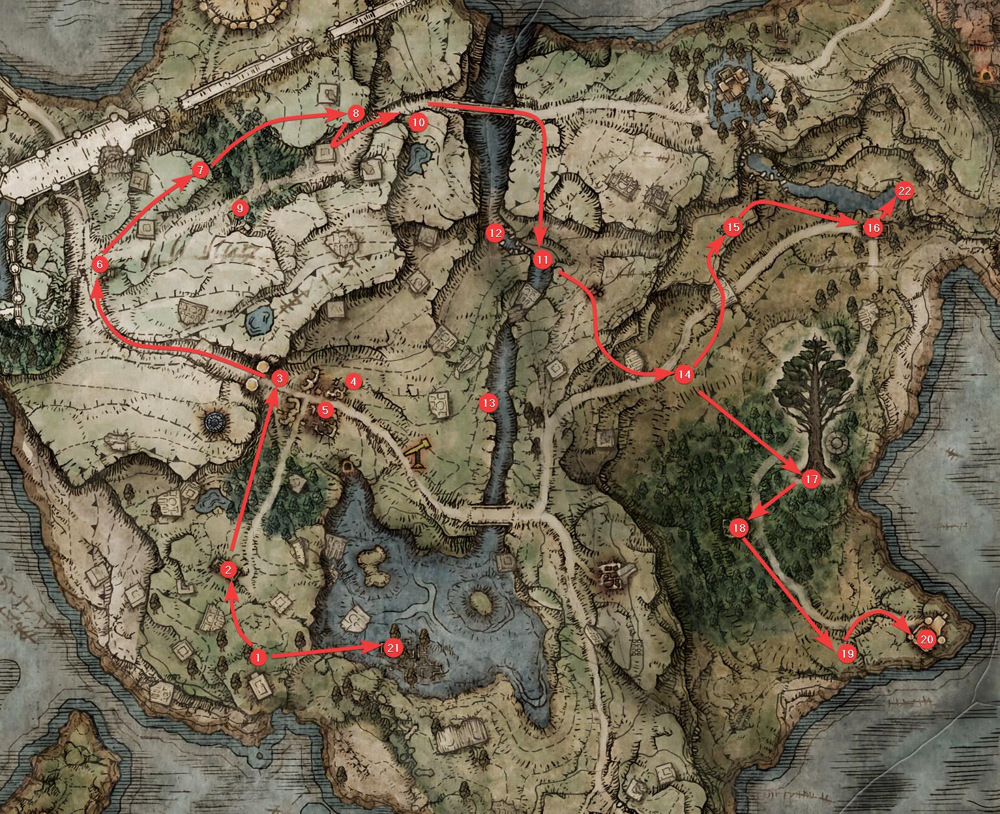
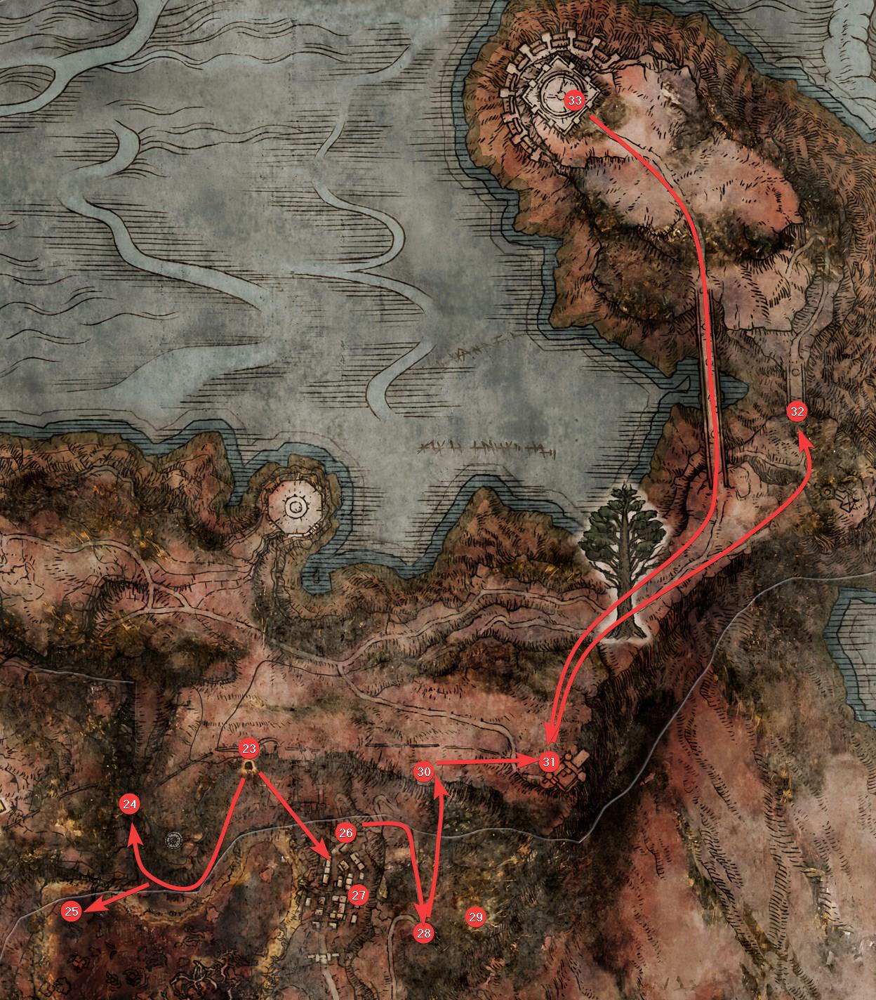

+++
title = '【艾尔登法环】超功利白金攻略'
date = 2024-06-10T16:30:00+08:00
draft = false
isCJKLanguage = true
+++

### 说明
* 本攻略旨在尽量功利，但是又对新手很友好(尽量先提升自己再攻略boss)地最速达成白金奖杯
* Steam成就和PSN奖杯是完全一致的，本攻略也等同于Steam全成就攻略
* 提示“小退”的地方，指退回游戏标题画面再继续游戏
* 追求速度的话，说明里没有明确说要点亮的赐福，都可以不点
* 标识为可选的行为，一般和你选择的攻略流派有关，请注意分辨
* 地图碎片非必要一般不会提及，如果不太熟悉地图，有需要的情况下可以自己去拿
* 圣杯露滴和黄金种子强化圣杯瓶可在每次坐赐福时检查，攻略内不会提示
* 所用流派的装备获取会适当提示，但武器获取一般不会提示，请按照自己的流派在中途拐一下去获取，护符的装备顺序建议是第一个格子【拉达冈的糜烂烙印】，后面的格子看自己的流派，之后在等级提升足够(尤其是血量和精力足够)后，可以换掉【拉达冈的糜烂烙印】
* 文中所用的skip都是可选路线，如果会的话可以选择，大多数需要一定的练习，新手不推荐
<!--more-->

### 出门探索
* 出生处理
  * 出生职业：如果打法师可以用观星者，打需要信仰的流派可以密使，其他流派均推荐武士
  * 遗物：基本上建议【交界地卢恩】，方便初期购买道具
  * 可以不打接肢贵族等他血条出现后直接跳崖送死
  * 漂流墓地的新手引导不用做，赐福也可以不点，直接坐电梯上去推开门
* 初期宁姆格福探索以及获取迪可达斯升降机符节

  * (1) 点亮赐福【引导之始】
  * (2) 在艾雷教堂购买3个龟裂壶和制作工具(如果是削韧打法同时可以顺便买10个飞刀方便之后续韧)，如果对自己初期boss战有信心不需要召唤骨灰可以不点赐福。如果遗物不是【交界地卢恩】，那么先点了赐福以后有钱了再回来买
  * (3) 一路向北，点亮赐福【关卡前方】，坐下后获得【灵马哨笛】，从此可以骑马遨游
    * (4) 【可选，如果要刮大白龙获取启动资金】 向东在第二辆马车上拾取【连枷】
    * (5) 【可选，如果玩普通武器换战灰推荐拿】 在关卡前方遗迹地下室开宝箱获得【砥石小刀】
  * (6) 拾取【黄金种子】和【石剑钥匙】并点亮赐福【风暴山丘的破屋】
    * 【可选，基本无必要】 可以在此处和小红帽对话获得灵魂水母
  * (7) 【可选】 如果打力武器流派，在风暴山丘获取【力气瘤露滴】
  * (8) 向东击杀山上葛瑞克骑士获取战灰【黄金树立誓】
  * (9) 南边和【习战者的破屋】里的贝纳尔交谈，如果有需要的战灰可以买一下
    * <r>**武器5/9**</r> 【可选】 如果后面神皮双人组不需要召唤他的话，可以现在就击杀贝纳尔获得【吞世权杖】(这里武器顺序编号用后面最终获取时的编号)
  * (10) 【可选】 如果打战技为主要输出手段的流派，向东在山上先解放壶哥，然后击杀壶哥获取饰品【战士壶碎片】
  * (11) 过圣人桥后向南用龙卷风一路跳下去到蒙流墓地东南的位置
  * (12) 【可选】 如果前期需要稍微能顶一点的骨灰，可以去蒙流墓地杀穿获得骨灰【“失乡骑士”英格威尔】，此骨灰唯一问题是需要104蓝才能召唤
  * (13) 【可选】 如果需要黄金鸡爪可以进蒙流洞窟打一下帕奇，原谅他后小退重进购买三个【黄金鸟爪】
  * (14) 从龙卷风向上跳到画家的破屋，最后向东点亮赐福【雾林边缘】
  * (15) 从【雾林边缘】出发，向东然后向北过肯尼斯·海德所在的拱桥来到一片墓地，在墓地上获取【法力斯的制作笔记①】，这是非常重要的打神皮类boss所需的催眠壶的制作笔记
  * (16) 向东到【玛莉卡第三教堂】获取【圣杯露滴】和【灵药圣杯瓶】
  * 传送回【雾林边缘】
  * (17) 【可选】 大多数情况下在前期比较推荐，向东偏南一点跑在小黄金树下拾取【漫绿结晶露滴】(各流派均推荐的露滴)和【大刺破露滴】(满蓄流推荐的露滴)
  * (18) 【可选】 需要满蓄的流派推荐必拿，向西南在雾林废墟内获取【斧护符】，不需要的也建议在雾林废墟内拾取多个【托莉娜睡莲】，此后路过废墟建议都搜刮一下【托莉娜睡莲】以备之后用
  * (19) 一路向东南跑，点亮【海德要塞】赐福
  * (20) 然后在要塞外拾取【黄金种子】，在要塞内爬到顶部获取【迪可达斯升降机符节（左）】
  * 【可选】 如果初期boss战需要召唤骨灰，传送到【艾雷教堂】并和菈妮对话获取【召魂铃】和某没用的三狼骨灰
  * 此时有两条路线可以选择，我这里按照速度和难度给了选择建议
    * 注意，以下两个步骤在抵达圆桌厅后建议购买【匕首】和【指头圣印记】，分别用于挂战灰【黄金树立誓】(为了降低总负重)和上各种祷告Buff，如果你打祷告流且已经有圣印记则无需再买。如果之前没有获取【召魂铃】，也可以在此时购买

    * A. 略困难，但是快一点，如果打法师务必走这条路线，如果打失色锻造石也建议走这条路线
      * (21) 传送回引导之始，向东跑到龙息废墟，拾取石剑钥匙后打开地下室的传送箱子
      * (23) 传送到【瑟利亚结晶坑道】，一路往坑道外跑点亮坑道口的赐福
        * (24) 【可选】 如果打失色锻造石武器，出坑道后右转向西靠边走，然后转北进入一个狭窄的甬道，在尽头的法师球身后失去【失色锻造石5】，可以将失色武器强化到+5
        * (25) 【可选】 如果打法师，出坑道后右转向西一直走到沼泽东南角的废墟，在地下室开宝箱获取【岩石球】，并在另一个建筑里获取【陨石杖】
      * 从【瑟利亚结晶坑道】出来向东南跑(路上可以拾取骨灰【腐败野狗】，如果你知道怎么配合这个骨灰上腐败来打boss的话)
      * 到达瑟利亚镇后你可以选择：
        * (26) 盖利德跳树skip(如果你会的话)
        * (27) 或者解密瑟利亚镇，注意如果不打法师只需要点亮东南方的火就可以通过，打法师则建议点亮西南方的火，然后拾取阳台上的丧失杖，并打开宝箱拾取【黑夜彗星】
      * <r>**【奖杯1/42】圆桌厅堂**</r> (28) 从瑟利亚镇后方一路向东然后转向南方，进入教堂拾取【圣杯露滴】并点亮赐福【腐败病教堂】，在赐福坐下(可解除传送限制)可第一次抵达【圆桌厅堂】
        * (29) 【可选】 如果是法师等需要【魔力对蝎】的流派请拾取腐败病教堂北边的【星光碎片】
      * (30) 向北从龙卷风跳上山顶拾取两个【锻造石7】一个【锻造石8】以及一把【石剑钥匙】
      * <r>**护符1/8**</r> (31) 向东北跑点亮赐福【法洛斯要塞】，在【法洛斯要塞】内获取【迪可达斯升降机符节（右）】和【拉达冈的糜烂烙印】
        * 【可选，大额启动资金获取】 传送回【法洛斯要塞】赐福，装备【连枷】后用战技把大白龙刮死，如果有【黄金鸟爪】死前记得吃
        * (32) 【可选，如果你会摔龙墓的黑夜骑兵，可搜对应视频】 趁黄金鸟爪还没过期(不能传送否则鸟爪buff会消失但可以坐火)一路向北跑，龙卷风下去，从往法姆大桥的路右边走，路过墓地后继续龙卷风下去，点亮赐福【雷恩魔法师塔】，切换到黑夜，摔死黑夜骑兵
    * B. 简单，但是稍微慢一点 (注意图上的路线标记为A路线，此路线后半段要和箭头方向相反跑)
      * (22) 传送到【玛莉卡第三教堂】，在北边摸传送门
      * <r>**【奖杯1/42】圆桌厅堂**</r> (33) 传送到【野兽神殿】，推开门点亮赐福，在赐福坐下(可解除传送限制)可第一次抵达【圆桌厅堂】
      * (31) 一路向南穿过法姆大桥(不管桥上的龙)，从小黄金树(不管腐败化身)后面的龙卷风向南跳上高处，点亮赐福【法洛斯要塞】
      * <r>**护符1/8**</r> 在【法洛斯要塞】内获取【迪可达斯升降机符节（右）】和【拉达冈的糜烂烙印】
        * 【可选，大额启动资金获取】 传送回【法洛斯要塞】赐福，装备【连枷】后用战技把大白龙刮死，如果有【黄金鸟爪】死前记得吃
        * (32) 【可选，如果你会摔龙墓的黑夜骑兵，可搜对应视频】 趁黄金鸟爪还没过期(不能传送否则鸟爪Buff会消失但可以坐火)一路向北跑，龙卷风下去，从往法姆大桥的路右边走，路过墓地后继续龙卷风下去，点亮赐福【雷恩魔法师塔】，坐火切换到黑夜，摔死黑夜骑兵
      * (30) 传送回【法洛斯要塞】赐福，向西南的一个山丘走，山丘顶部有两个【锻造石7】一个【锻造石8】以及一把【石剑钥匙】
      * (28) 从山丘东边的龙卷风跳下去，然后一路向南进入教堂拾取【圣杯露滴】并点亮赐福【腐败病教堂】
        * (29) 【可选】 如果是法师等需要【魔力对蝎】的流派请拾取腐败病教堂北边的【星光碎片】

* 湖区和亚坛高原的初期探索
  * 点亮赐福【傍湖断崖】
  * 获取伊利斯教堂内的圣杯露滴
  * 点亮赐福【利耶尼亚湖（湖边）】
  * 在【拉斯卡废墟】触摸传送门前往学院门口，点亮赐福【学院门前】
  * 向西跳下去，然后向西北方向跑，不管辉石龙，直接拾取他身后的【学院钥匙】后传送回【学院门前】
    * 【可选】 法师和祷告流可以拾取钥匙后往西跑，过【四钟楼山脚】后拾取法术流左手神器【水母盾】
  * 传送回【学院门前】，进学院门后坐大电梯上去，然后一本道跑到大水车处上到上层，点亮赐福【校舍内的教室】
    * 【可选】 往前右转上楼梯后左手有个书架是隐藏墙，内有【魔法师球护符】和魔法【帚星】，都是法师流的重要道具
  * 【可选】 使用普通锻造石武器推荐路线
    * 从【学院门前】出发，向东北点亮赐福【门前镇北方】，路上可以开一个宝箱拾取【石剑钥匙】
    * 一路往东北走抵达【雷亚卢卡利亚结晶坑道】，进入深处击败boss获取【锻造石铃珠1】
    * 传送回【门前镇北方】，向东南触摸亭子里的传送门抵达湖区西边区域
  * 【如果不使用普通锻造石武器】 从【学院门前】出发，向东偏北一点触摸亭子里的传送门抵达湖区西边区域，路上可以开一个宝箱拾取【石剑钥匙】
  * 穿过【王室领地废墟】打破隐藏墙点亮赐福【通往城寨的道路】
  * 向北点亮赐福【卡利亚城寨】
    * 【可选】 如果打智力流派，在去往卡利亚城寨途中右侧悬崖注意看，下面有落脚的地方可以跳下去，然后沿着左边山壁走在石盆拾取【智力瘤露滴】，然后传回去重新往卡利亚城寨跑
  * 向东穿过一片池塘，从石梁上跳到对面，然后向南抵达【彼鲁姆教堂】点亮赐福并拾取【圣杯露滴】
  * 向北抵达并点亮赐福【迪可达斯大升降机】
  * 从升降机上去亚坛高原，一路向东北跑，在营地里拾取【石剑钥匙】，然后向北点亮赐福【亚坛大道的三叉口】
    * 【可选】 如果是法师等需要【魔力对蝎】的流派，向东的路上向北拐进一个洞，拾取【琥珀星光】
  * 向东跑上台阶，不要管两个大树守卫，进城门点亮赐福【城外幻影树】并拾取两个【黄金种子】
    * 【可选】 如果使用普通锻造石，向东绕下去再往南进入【封印坑道】，打开幻影墙并打开宝箱拾取【锻造石铃珠2】后跑出坑道传回【城外幻影树】
  * 一路向北跑，不要管跳下来的石像鬼，路上再次拾取两个【黄金种子】，然后也不用管路上变成恶兆妖鬼的小兵，点亮赐福【城外战场遗迹】
    * 【可选】 如果会用摔龙装大树(可搜相关视频看教程)，直接跑过去摔死【龙装大树守卫】并点亮赐福【王城城墙前方】

* 第一次的战斗准备工作，期间钱不够可以捏掉路上拾取的各种黄金卢恩
  * 【如果使用失色锻造石武器】 传送到【通往城寨的道路】旁边的【伊吉】对话，购买锻造石1-4，强化武器到+4
  * 【如果使用非失色锻造石武器】 传送到【圆桌厅堂】，把锻造石铃珠给【孪生老妪】后购买锻造石1-4(每一把武器需要每种锻造石12个)，到铁匠或者【伊吉】处强化到+12
  * 【如果之后需要强化骨灰】 在【圆桌厅堂】和铁匠提罗德莉卡，再和罗德莉卡对话，再回去和铁匠提罗德莉卡
  * 升级加点：如果需要火赐请把信仰点到15，剩下按照个人技术水准加点，比较菜就多点血，耐力点到够用(一般15-20)即可，如果前期需要召唤骨灰需要则点一些蓝(看你主用的骨灰耗多少专注值来点)，如果走法术流派也要点一些蓝(点到专注值100以上)，剩下点你的流派主属性
  * 确认记忆了需要的法术，为随意一把武器(比如之前可能买了的匕首，为了重量尽量轻)安装了战灰【黄金树立誓】，并为主武器安装了需要的战灰(部分战灰可能要额外打一些boss或者去特定地方获取，看个人需要，也有一些要在之后获取，获取后不要忘记第一时间安装上)

* 亚坛初期探索收尾，以及盖利德区域的初期探索
  * 传送到【亚坛大道的三叉口】，向西北方拾取【黄金种子】，然后穿过低处的营地到西边的小山坡上拾取另一个【黄金种子】，并点亮赐福【近黄金树的山丘】
  * 【可选】 如果不打换血的流派，可以在【卢克斯废墟】内击败【“亚人女王”姬丽卡】获取【献斗剑护符】
  * 【可选】 如果打跳劈武器
    * 花完身上的卢恩【可以先去做下面的装备准备工作强化武器】
    * 传送到【近黄金树的山丘】，向西北方向下坡，抵达一片大湖后在湖的东北方进入【贤者洞窟】
    * 此处有很多隐藏墙要打破，里面有很多宝箱，如果需要复制战灰请务必拾取【失力战灰】，路上【石剑钥匙】可以顺一下，最后在深处拾取【猛禽黑羽】
    * 用【赐福记忆】或者跳崖自杀传送回上一个赐福点
  * 传送到【玛莉卡第三教堂】，向北通过三个龙卷风跳上高处，然后沿路向东爬到有火焰熏烧痕迹的地方
  * 【可选】 如果你的流派主要依赖物理或火焰输出，或者需要战灰【狮子斩】
    * 【如果需要巨剑】 点亮【腐败旁露台】后先沿着大路往东在马车上获取巨剑后再传送回来
    * 向南一路跑到【盖尔要塞】附近，点亮赐福【盖尔要塞北方】
    * 在【盖尔要塞】东边靠墙处拾取祷告【火焰啊，赐予我力量】
    * 如果需要狮子斩，在【盖尔要塞】内击杀狮子狗获取战灰【狮子斩】
    * 向东点亮赐福【熏烧火墙】
  * 【如果不去盖尔要塞】 一路向东沿路再转南，穿过【奇列姆废墟】后点亮赐福【熏烧火墙】
    * 【如果需要巨剑】 路上的马车上获取
  * 向南点亮赐福【龙飨大教堂】，可以不管路上的腐败龙
    * 【可选】 如果是法师等需要【魔力对蝎】的流派可以在龙飨大教堂西北沿着悬崖的地方拾取【星光碎片】
  * <r>**法术1/7**</r> 在教堂内换【桂奥尔的咆哮】
  * 向东后在三叉路口转南，路上拾取【黄金种子】，一路向东南最后点亮赐福【不破大桥】
    * 【可选】 三叉路口继续向前点亮赐福【艾奥尼亚沼泽（南岸）】，切换到夜晚，可以击杀北边的死亡仪式鸟获取几乎是本体最强力的武器【死亡钩棒】，但是此鸟很厉害，如果不会摔的话，建议上圣律等特攻buff、扔圣水壶等方式再打
  * 【如果流派需要岩石剑】 东边的小山上击杀粪金龟获取战灰【岩石剑】
  * 【如果流派需要炎击】 穿过不破大桥，绕到红狮子城后方入口处击杀粪金龟获取战灰【炎击】
  * 【可选】 如果想后面富裕一点的话，传送到【熏烧火墙】，向东进入废弃洞窟(此洞窟路较恶心，可参考跑图视频)，击败最后的双尊腐骑士boss获得【金色粪金龟】
  * 【可选】 如果打削韧的流派，传送到【法洛斯要塞】，向北跳下龙卷风并击杀【腐败化身】获得【岩刺破露滴】
  * **法术2/7** 传送到【利耶尼亚湖（湖边）】，从东南边的龙卷风跳上去，在封印监牢内击杀【“盗火者”亚当】获取【恶神火焰】

### 宁姆格福地区的攻略
* 史东薇尔攻略
  * 确认装备强化，个人加点，法术记忆，战灰安装都无误，卢恩花得比较干净后(主要怕你后面跑图死了掉钱)，我们开始攻略【史东薇尔城】
  * 传送到【风暴山丘的破屋】，向北绕一圈往南进入史东薇尔城的隧道，点亮赐福【通城隧道】
  * <r>**【奖杯2/42】“恶兆妖鬼”玛尔基特**</r> 击杀【“恶兆妖鬼”玛尔基特】，获取第一个【护符皮袋】
  * 点亮赐福【史东薇尔正门】
  * 和旁边屋子里的【葛托克】对话，选第二项从正门进入，然后在门前等他喊开门
  * 沿着右边往前边跑边跳，如果被射到就在爬起来的时候向前滚一下，上坡以后基本就安全了
  * 右转进入一扇大门，点亮赐福【宁姆格福神授塔（桥上）】
  * 回到正路向前跑，穿过上坡楼梯的交叉火力，穿过大院子后上楼梯左转进入一个小房间点亮赐福【升降机旁房间】
  * 【可选】 如果需要物理质变或者流派为跳劈
    * 从这里往回跑，从墙上的小门进去(注意不是右边的地窖)，再穿过一扇小门后右转
    * 【如果需要物理质变】 躲过或者击杀接肢贵族后再次右转进小门，左手是一个小恶魔封印雾门，用石剑钥匙打开雾门获取【铁制砥石刀】
    * 【如果流派为跳劈】 穿过接肢贵族所在房间直接踩电梯上去，抵达赐福【城墙塔】，往南的小门出去后右转加速跑跳到对面屋顶上，然后再从石柱往上，抵达一个数名流刑士兵所在的方形区域，爬长长的梯子到塔顶拾取【钩爪护符】
    * 传送回【升降机旁房间】
  * 从大路往北狂奔，拾取【黄金种子】后抵达【深处小房间】点亮这个赐福
  * <r>**【奖杯3/42】“碎片君王”葛瑞克**</r> 击杀史东薇尔最终boss葛瑞克
  * <r>**【奖杯4/42】大卢恩**</r> 传送到【宁姆格福神授塔（桥上）】，穿过长长的神授桥触摸最后的传送门，然后推开神授塔的大门坐电梯到塔顶激活【葛瑞克的大卢恩】

* 击杀第一个大卢恩Boss后顺手做一些杂事
  * 传送回【圆桌厅堂】，见解指，听她废话完
  * 传送到【学院门前】，从西边跳下去然后往南跑到【湖中坠落遗迹】点亮赐福
  * 【可选】 如果打灵巧流派，向南跑到一个大岛上，在石盆里拾取【灵巧瘤露滴】
  * 从【湖中坠落遗迹】向东跑到一个【蔷薇教堂】，和白面具对话领取六个指头
  * 向南跑，从一个斜坡往西上坡，点亮赐福【白金村】，然后折返向上(两座桥都不要过)，在墓地旁边有个罐子，打破后和老先生【艾尔帕斯】对话(要省时间可以直接击杀之)获得【圣树秘密符节（右）】
    * 【可选】 在白金村东边的湖里有一棵树下有十个【托莉娜睡莲】，如果之后不够用可以来薅，所以这里点了赐福

* 啜泣半岛
  * 传送到【雾林边缘】，一路向北跑(路上有一个黄金鸟爪，知道在哪的可以顺一下)，穿过大桥和山谷，抵达一个有商人的地方，点亮赐福【摩恩城墙前】，可适当购买一些【廓尔喀弯刀】之后吸引敌人和续韧用
    * 【可选】 如果是法师等需要【魔力对蝎】的流派可以在大桥前的气流跳上去，悬崖边拾取【星光碎片】
  * 向东绕到【癫火教堂】拾取【圣杯露滴】
  * <r>**骨灰1/6**</r> 从东边跳下去过桥抵达【灵庙原野地下墓地】，击败Boss获得骨灰【“无头骑士”露缇尔】，然后如果要做以下任意可选项则用Boss房间的传送点出墓地
    * 【可选】 如果打信仰流派，向西南山下跑沿着山脚在靠近悬崖边的石盆里拾取【信仰瘤露滴】
    * 【可选】 向北抵达【巡礼教堂】获取【圣杯露滴】
    * 【可选】 往西南跑到【玛莉卡第四教堂】获取【圣杯露滴】
  * 传送到【摩恩城墙前】，向南跑进摩恩城
  * <r>**【奖杯5/42】狮子混种**</r> 一路跑到深处击杀最后的boss【狮子混种】
  * <r>**武器1/9**</r> 狮子混种会掉落【剑骸大剑】

### 快速攻略到获取满强骨灰【仿生泪滴】
* 红狮子城攻略
  * <r>**【奖杯6/42】“碎片君王”拉塔恩**</r> 【如果会腐败病教堂的碎星skip】传送到【腐败病教堂】，skip后击杀碎星，结束后坐火
  * 传送到【不破大桥】，触摸传送门进入红狮子城，点亮赐福【广场前房间】
  * <r>**【奖杯6/42】“碎片君王”拉塔恩**</r> 【如果不会腐败病教堂的碎星skip】和红狮子城主交谈后开启碎星Boss战并击杀碎星，结束后坐火，然后传送到【广场前房间】
  * 此时可以传送回【圆桌厅堂】从解指处领取第二个【护符皮袋】
  * <r>**武器2/9**</r> 从【广场前房间】出发，穿过广场和城主反复交谈后再传送回【广场前房间】，此时广场已经变成了Boss战场所，击杀狮子混种和熔炉骑士双Boss获得【遗迹大剑】，如果现在打不过可以以后变强了再来

* 卡利亚城寨攻略
  * 传送到【卡利亚城寨】，进门后沿路向前点亮赐福【城寨下部】
    * 【可选】 攻略流程如果需要结冰壶，可以进城寨后右转在一个小屋内拾取结冰壶的制作书
  * <r>**武器3/9**</r> 出门后在第一个三叉路口左转，尽头往下跳两次，梯子下去拾取【夜与火之剑】
  * 传回【城寨下部】，从另一条路向前上电梯抵达【城寨上部】
  * <r>**【奖杯7/42】禁卫骑士罗蕾塔**</r> 拾取门外的【黄金种子】后一路台阶上去，击杀【禁卫骑士罗蕾塔】
  * 从北边的门出去，不要管路上的月光龙，直接进入西边中间的塔，点亮赐福【菈妮魔法师塔】
    * 【可选】 如果是法师等需要获取【魔力对蝎】的流派，在途中有一个隐藏的地下室，进去和地上的建言交互一次
  * 和塔顶的菈妮交谈，然后下来和塞尔维斯、伊吉交谈后坐火

* 获取满强骨灰【仿生泪滴】
  * 传送到【雾林边缘】或者【海德要塞西方】，进入地图上标识的深坑，抵达永恒城诺克隆恩
  * 【可选】 如果要强化骨灰，过赐福后正面亭子上拾取【灵依墓地铃兰铃珠1】
  * <r>**【奖杯8/42】仿身泪滴**</r> 从中间狭窄的下坡下去后右转，进入雾门击杀【仿生泪滴】(要偷懒可以脱光进去等泪滴爬起来再换上武器)
  * 向北穿过长长的桥，左手下去先点亮就近的3个火盆(6个火盆位置分别标识为西北、北、东北、西南、南、东南，这里点亮的是东北、东南、南三个)，然后点亮赐福【祖灵森林】
    * 【可选】 如果打失色锻造石武器且之前没有获得失色锻造石5，这里桥上的粪金龟击杀后就能获得【失色锻造石5】
  * <r>**骨灰2/6**</r> 向南跳到房顶，沿路向前用石剑钥匙打开封印雾门，获取骨灰【仿生泪滴】
  * 继续向前到底部的大房子里获取【猎杀指头刀】和【大朵灵依墓地铃兰】
  * 传送回【菈妮魔法师塔】
  * 【可选】 如果需要【魔力对蝎】
    * 到东南边的塞尔维斯魔法师塔，和塞尔维斯对话后获取药水
    * 回去把药水交给百智，再回来找塞尔维斯，让你选骨灰的时候选壶男(选错也没关系，上面我们已经多拿了一个【星光碎片】，够用)
    * 小退两次后回来和塞尔维斯说话，用【星光碎片】换取另一个骨灰，然后继续对话选听取秘密，最后交出【琥珀星光】，再次对话后获取【魔力对蝎】
  * 在【菈妮魔法师塔】顶和菈妮交谈交出【猎杀指头刀】，获得【卡利亚颠倒像】
  * 去东北方的【蕾娜魔法师塔】，门口封印已经解除，爬到塔顶触摸传送门来到【安瑟尔河主流】
    * 【可选】 如果打法师，爬楼梯后在后侧箱子里有一套【雪魔女套装】，其中帽子可以提升冰魔法的伤害
  * 在前方的棺材上获取【娇小菈妮】，点亮赐福【安瑟尔河主流】后坐下和【娇小菈妮】对话三次直到她说出真相并拜托你去消灭灾厄影子
  * 一路向前并右拐(路上可以薅一些铃兰，可稍微省钱)，穿过倒吊的畸形繁星后一直向前(不要去左边的洞里)，穿过一个小门后点亮赐福【“永恒之城”诺克史黛拉】
    * 【可选】 如果打失色锻造石武器，击杀这个畸形繁星可以获得【失色锻造石7】
  * 往回爬梯子上去，进入刚才路过的那个洞，尽头右转一路走，在前方有一个倒吊的畸形繁星
    * 【可选】 横梁上的箱子里是【艾斯缇薄翼】，算是一把强力武器
    * 【可选】 如果打失色锻造石武器，出洞右转高处的光点是【失色锻造石6】，掌握技巧可以直接跳上去，或者可以绕一圈上去
  * <r>**【奖杯9/42】诺克史黛拉的龙人士兵**</r> 小心地从边缘跳下去，不要摔死，然后向西沿着河流走，转北最后来到一片开阔地带，击杀【诺克史黛拉的龙人士兵】，旁边宝箱里是【大朵灵依墓地铃兰】
  * 传送回【“永恒之城”诺克史黛拉】
  * 先从正面楼梯上去
    * 【可选】 如果要强化骨灰，左边第二间房子里获取【灵依墓地铃兰铃珠2】
    * 【可选】 如果打失色锻造石武器，楼梯顶部向前的窄廊正中左边有扇窗可以跳进去，宝箱里是【失色锻造石7】
  * <r>**护符2/8**</r> 在最高处的建筑宝箱里有护符【诺克史黛拉之月】，由两个仿生泪滴和一个黑夜女巫守护
    * 【可选】 如果打失色锻造石武器，这个建筑前的粪金龟掉落【失色锻造石6】
  * 传送回【“永恒之城”诺克史黛拉】，并一路向前，在左边一个建筑内有个电梯下去，点亮赐福【诺克史黛拉水潭】
    * 【可选】 如果要强化骨灰，在路上第二个上楼处上去尽头宝箱里有【灵依墓地铃兰9】
    * 【可选】 如果要强化骨灰，在河里拾取【灵依墓地铃兰7】和【灵依墓地铃兰8】
    * 【可选】 如果打失色锻造石武器，河的左侧悬崖边有一个【失色锻造石7】
    * 【可选】 【诺克史黛拉水潭】旁边有一个【灵依墓地铃兰9】
    * 【可选】 如果要强化骨灰，回到【圆桌厅堂】，把铃珠交给孪生老妪后购买灵依墓地铃兰1-6，然后去【罗德莉卡】处将你要用的骨灰升满，通常推荐强化【仿生泪滴】，注意这个骨灰消耗HP才能召唤，需要660点HP，如果要在召唤后回满HP需要至少+6的圣杯瓶
  * 向前击杀【灾厄影子】获得【被丢弃的王室钥匙】(注意他用战技的时候向前滚到他身后可以轻松背刺)
  * 坐电梯下去点亮赐福【腐败湖】，腐败湖有个简答的攻略技巧是：“在岸上中腐败可以获得较低等等级的腐败debuff”，需要在腐败湖里翻滚后再回到岸上才能在岸上中腐败
    * 【可选】 如果打失色锻造石武器的话，向左跳下去靠墙有个【失色锻造石8】
    * 【可选】 如果打失色锻造石武器或者打白王剑的话，向北一路踩三个机关，最后踩北方的一个机关升上去，击败精英敌人白王后获得【白王剑】，并在远端柱子的光点处获得【失色锻造石9】，此处有个技巧，立即小退后进来就会回到腐败湖里，不用绕一圈
  * 穿过腐败湖点亮赐福【大回廊】，前方Boss难度较高且月光祭坛的敌人等级加成极高，我们暂时不去惹他们
    * 【可选】 如果用失色锻造石武器，此时可以回去把失色武器+9，横行了
    * 【可选】 如果你要用月光大剑或者魔法里的亚杜拉的月光剑，那么此处可以选择看下面的攻略学院+击杀艾斯缇部分后直接去月光祭坛
    * 【可选】 如果你需要切换武器战灰，但之前没有获取【砥石小刀】，此时可以在圆桌厅堂的孪生老妪处购买

* 收集小跑图
  * 传送到【近黄金树的山丘】，向北上坡转西抵达沸滚河，然后向北转向西抵达【沸滚河终点】
    * 【可选】 如果是雷伤害流派，在路上的【威达姆废墟】西北方的【威达姆墓地】内开小恶魔封印雾墙可获取【雷对蝎】
    * 【可选】 如果是火焰伤害流派，在【莱多要塞】内可以获取【火对蝎】
  * 再往南(不要管路上的熔岩土龙)然后到悬崖边转西，一路跑到【遁世者村】，不管女王，直接冲到她身后点亮赐福【“起源魔法师”亚兹勒】
  * <r>**法术3/7**</r> 坐火后和旁边的亚兹勒交谈，获取魔法【彗星亚兹勒】，这是法师后面打Boss的终极解决方案，但需要配合【蓝秘密露滴】(要击杀火山官邸外的腐败树灵获取)
  * <r>**法术4/7**</r> 花光身上的卢恩，传送到【腐败病教堂】，向正北方跑，山壁上有隐藏墙，进去是【瑟利亚隐藏洞窟】，进洞过两堵隐藏墙后进入右边下方区域用钥匙打开封印，从卢瑟特处获取魔法【毁灭流星】，然后赐福记忆或者自杀出来

### 主线速推
* 王城罗德尔攻略
  * 【如果之前没有摔死龙装大树守卫】 传送到【城外战场遗迹】，一路向东抵达王城城墙前，击杀【龙装大树守卫】
  * 【如果之前摔死了龙装大树守卫】 传送到【王城城墙前方】
  * 进入王城点亮赐福【王城东边城墙】
  * 【如果会王城速降】 王城速降后从大路向前
  * 【如果不会王城速降】 沿着屋顶前进，一路向下跳到达王城中间的大道
  * 在一个黄金树化身跳下来的地方(他掉一个王之卢恩，想要赚钱可以杀掉)右边有个小门，进去点亮赐福【大道旁露台】
  * <r>**武器4/9**</r> 【可选】如果会龙狙skip，直接回到大道从右边内侧的大楼梯上去，跳到有【石剑钥匙】的亭子顶部，然后skip上去获取【古兰桑克斯的雷电】
  * 从【大道旁露台】出发向北爬上龙骨，最后点亮【王城西边城墙】
    * 【可选】 如果打失色锻造石武器且之前没有获得失色锻造石6，龙骨下方有个分叉楼梯，下去后贴右边墙走，尽头是一个【失色锻造石6】
  * <r>**【奖杯10/42】“初始之王”葛孚雷**</r> 沿着树爬上去，抵达黄金树大教堂并击杀“初始之王”葛孚雷，获得第三个【护符皮袋】
    * 【可选】 如果打失色锻造石武器且之前没有获得失色锻造石5，教堂角落里的光点是三个【失色锻造石5】
  * <r>**武器4/9**</r> 如果不会龙狙skip，从大教堂西边出去往下走坐电梯下去，然后在熔炉骑士旁边往下看，有一个可以跳下去落脚的地方，跳下去后沿着巨大的长枪往上走，小心别脚滑，在最上方获得【古兰桑克斯的雷电】
  * <r>**【奖杯11/42】“碎片君王”蒙葛特**</r> 从【黄金树大教堂】出发沿着树爬上去，点亮赐福【女王闺阁】，往前击杀【蒙葛特】，然后触摸台阶上方的黄金树后回来坐火和梅琳娜交谈
  * 【如果会王城速降】 从【王城东边城墙】速降后推开东边大门
  * 【如果不会王城速降】 从【大道旁露台】出发沿着大路往东推开大门
  * 一路向前拉大电梯上去，再穿过长长的桥，坐电梯下去点亮赐福【禁域】

* 巨人山顶攻略
  * 穿过禁域，抵达【洛德大升降机】，点亮赐福后坐升降机上去
  * 点亮赐福【萨米尔废墟】
    * 【可选】 如果要强化普通锻造石武器，向东进入废墟深处获取【锻造石铃珠3】，然后传送回【圆桌厅堂】交出铃珠够买锻造石把武器强化到+18
  * 一路向北到达一个桥头有火焰主教的长桥，穿过长桥
    * 【可选】 如果要复制战灰，桥上可以拾取一个【失力战灰】
  * 抵达赐福【古遗迹降雪谷】后有两条路可以选择
    * 【如果会降雪谷skip】 skip后穿过桥往东点亮赐福【古遗迹山谷的山崖上】
    * 【如果不会降雪谷skip】 向北后转向东，在左边尽头处有一个龙卷风上去，上去后向左穿过桥再向东点亮赐福【古遗迹山谷的山崖上】
  * <r>**法术5/7**</r> 穿过隐形桥并解密【异端魔法师塔】，在塔顶获得法术【创星雨】，解密方法可搜索对应视频
  * 从北边出魔法师塔，一路向北点亮赐福【降雪棱线路】
    * 【可选】 此时可向西去【玛莉卡第一教堂】获取一个【圣杯露滴】
  * 向北穿过长长的石桥，然后再一路向北点亮赐福【安歇教堂】并获取【圣杯露滴】，此处老翁会入侵并掉落比较强力的武器【尸山血海】
    * 【可选】 普通锻造石武器强化的话，安歇教堂旁边山上的大骷髅嘴里有一个古龙岩锻造石
  * <r>**【奖杯12/42】火焰巨人**</r> 向东往下面走，点亮赐福【火焰大锅下方】，然后从两个入口中的任意一个进去击杀【火焰巨人】
  * <r>**【奖杯13/42】黄金树祝融**</r> 爬上火焰大锅，在赐福点和梅琳娜交谈点燃黄金树，抵达天空城【法姆·亚兹拉】

* 天空城法姆·亚兹拉攻略
  * 一本道向前点亮赐福【龙教堂】(路上会路过另外3个赐福点)
    * 【可选】 打失色武器的话，接近【龙教堂】的地方有一个光点是失色锻造石9，如果之前没有获取过可以在这里获取
  * <r>**【奖杯14/42】神皮双人组**</r> 从中间阳台跳下去，击杀神皮双(叕)人组(可以先沿着边走，在深处右转点亮另一个赐福【龙教堂（耳堂）】，万一打不过从这里出发会更近)
    * 打不过可以召唤贝纳尔，需要先去风暴山丘的【习战者的破屋】和贝纳尔交谈一次，他的召唤印记才会出现在这里
  * 从东北的小门出去，一路向前，跳过空中的浮板后右转在右边的门处出去
    * 【可选】 如果是普通锻造石武器，且要强化第二把，此处可以不右转而是向前上楼梯，后立即左转，跳上悬浮的石柱拾取【古龙岩锻造石】
  * 穿过一系列浮板，不要管面前的熔炉骑士，右边跳下去点亮赐福【龙教堂（屋顶）】
    * 【可选】 在空中的浮板里有一个【龙徽盾护符＋２】
  * <r>**【奖杯15/42】弒神武器**</r> 【可选】 如果是打普通锻造石武器，此时可以传送到【圆桌厅堂】，交铃珠购买锻造石后直接强化到+25
  * 此时有两条路线可以选
    * 【如果会鹰脚大道skip】 鹰脚大道skip后来到一个通向有宝箱的小房子的甬道
      * <r>**武器5/9**</r> (如果之前没有击杀贝纳尔) 甬道尽头贝纳尔会入侵，击杀他获得【吞世权杖】
      * <r>**护符3/8**</r> 打开房子里的宝箱获得【古王护符】
      * 转身爬上楼梯，在大桥右边下去点亮赐福【大桥侧边】并把电梯拉上来(以后要用)
    * 【如果不会鹰脚大道skip】 穿过鹰脚大道抵达一个残血古龙处
      * <r>**【奖杯15/42】弒神武器**</r> 【可选】 如果打失色武器的话，残血古龙后方亭子里有一个【古龙岩失色锻造石】，之后传回【圆桌厅堂】就可以强化失色武器到+10
      * 从残血古龙右边继续向前，越过倒下亭子做成的通道，再次右转进入一个房子，然后绕到后面坐电梯上去点亮赐福【大桥侧边】
      * 出去楼梯上去后左转进入远处的房子，然后右转爬楼梯下去
      * <r>**武器5/9**</r> (如果之前没有击杀贝纳尔) 这里的甬道尽头贝纳尔会入侵，击杀他获得【吞世权杖】
      * <r>**护符3/8**</r> 打开房子里的宝箱获得【古王护符】
  * 此时虽然已经有满强武器，但是天空城最终Boss黑剑伤害比较高容易让我们暴毙，我们先放松一下去其他地方推进一下顺便提升一下自己

### 回去爽吃前中期Boss
* 部分Boss和支线
  * <r>**【奖杯16/42】“熔岩土龙”马卡尔**</r> 传送到【彼鲁姆教堂】，走下山那边，一直跑到头(路上可以拾取【黄金种子】)，爬梯子上去，一本道走到底，击杀【“熔岩土龙”马卡尔】
  * <r>**护符5/8**</r> 传送到【近黄金树的山丘】，向南往低处走，穿过一个山洞，抵达一个封印监牢，用【石剑钥匙】解封后击杀Boss【“接肢”葛孚亚】获得【葛孚雷的肖像】
  * 传送到【亚坛大道的三叉口】，向北走然后跳下去抵达【玛莉卡第二教堂】，拾取【圣杯露滴】，此处会有红灵入侵，可以获得对人形怪的强力武器【艾琉诺拉的双头刀】
  * 从教堂出来，西北方向的龙卷风向上跳，然后再跳一个龙卷风后向西过桥点亮赐福【罪人桥】
    * 【可选】 如果你打祷告流，或者点数有剩余可以把信仰点到25的话，从这里一路向北，在一个破屋里拾取祷告【黄金树立誓】，注意这里有吃人妹入侵
  * 从【罪人桥】赐福出发，向东过桥后在废墟的最东边区域看到一个红色召唤印记，交互后入侵击杀【玛格纳斯】(或者入侵三次均被他击杀也可以)
  * 再次从【罪人桥】赐福出发，向东过桥后向南跳下龙卷风，再向东跳下龙卷风到达底部大河，一路向北穿过狭窄的山缝，抵达日荫城
  * <r>**【奖杯17/42】“铁棘”艾隆梅尔**</r> 攻略完日荫城，击杀最终Boss【“铁棘”艾隆梅尔】
    * <r>**武器6/9**</r> Boss会掉落玛雷家行刑剑
  * 传送到【城外战场遗迹】 往北出大门，然后立刻向左转沿着小路往西，抵达【唤雷教堂】拾取【圣杯露滴】
  * <r>**骨灰3/6**</r> 然后回到山上向北，到达【尊贵者的英雄墓地】门口，这里有个【黑刀】守护，通关墓地击杀Boss后掉落骨灰【“古龙骑士”克里斯托福】
  * 传送到【学院门前】或者【门前镇北方】赐福，一路向东跑抵达【卡利亚书斋】，放置【卡利亚颠倒像】，到达底部坐电梯下去，推门后穿过长长的神授桥(不管路上的神皮贵族)，再推门坐电梯到塔顶拾取【死亡咒痕】

* 白面具任务线进鲜血王朝
  * 传送到【湖中坠落遗迹】，向西跑到【蔷薇教堂】和白面具交谈，获得【鲜血君王的立誓布】
  * 传送到【迪可达斯大升降机】，出门后向东跑，从悬崖下面往龙卷风位置跑，然后用龙卷风直接跳上癫火塔并清理顶部的敌人
    * 【可选】 如果打信仰流派，或者你之后有富余点数可以把信仰点到33，可以开癫火塔第三层的宝箱获取【夏玻利利的嘶吼】，伤害加成方面属于【火焰啊，赐予我力量】的上位替代(但没有回精加成)
  * 向西跑进村后上山抵达【镇静教堂】，拾取【圣杯露滴】并和旁边椅子上的女巫为【鲜血君王的立誓布】染血(此处会有火灵入侵，但对我们现在的强度来说毫无鸭梨)
  * 再次传送到【湖中坠落遗迹】，向西跑到【蔷薇教堂】和白面具交谈，赋予血指后再次交谈获得【纯血骑士勋章】
  * 直接使用【纯血骑士勋章】来到王朝，一路爬楼梯上去，穿过黑暗的甬道(里面有一个【王之卢恩】不要错过)，点亮赐福【王朝庙（中段）】
    * 【可选】 如果使用失色锻造石武器，之前没有在天空城获得【古龙岩失色锻造石】的话，此处一群白金之子和一个鲜血贵族保卫的宝箱里有一个，你可以用【廓尔喀弯刀】攻击旁边的柱子吸引他们的注意力后去偷，也可以杀光他们后获取
  * <r>**【奖杯18/42】“碎片君王”蒙格**</r> 坐大电梯上去，击杀“鲜血君王”蒙格，尽量不要让他0出来，一般来说现在的强度，如果是法师或者祷爷，或者近战有出血甚至配合骨灰都不是什么问题，击杀后如果有的话建议使用【黄金鸟爪】增加获得的卢恩

* 学院攻略
  * <r>**【奖杯19/42】拉达冈的红狼**</r> 传送到【校舍内的教室】，一路往前上楼梯，击杀【拉达冈的红狼】并点亮赐福【讨论室】
  * <r>**护符5/8**</r> 出【讨论室】后立刻右转再右转，在栏杆外侧的楼梯爬到讨论室上方，开宝箱获得【拉达冈的肖像】
  * <r>**【奖杯20/42】“满月女王”蕾娜菈**</r> 从讨论室出来后走东边的大桥，上大电梯后推开门击杀【“满月女王”蕾娜菈】
  * 打开女王旁边的宝箱获取【暗月戒指】

* 火山官邸攻略
  * 建议把钱花完，传送到【校舍内的教室】，往回出门，从大水车另一侧下去到底部，被掳人少女人偶抓进去吃死，被传送到火山
  * <r>**【奖杯21/42】神皮贵族**</r> 从右侧不会摔死的位置跳进岩浆，然后往前上楼梯，坐电梯上去，穿过一个黑焰习武修士进门，击杀“神皮贵族”，如果不太会打可以做催眠壶催眠后打
  * 打完后坐火，然后从旁边的电梯上去，再一路向前(可以选择过岩浆爬梯子，也可以跳进建筑内部从里面走)，最后触摸传送门来到赐福【谒见之路】，向前进雾门拾取旁边的大蛇矛
  * <r>**【奖杯22/42】“碎片君王”拉卡德**</r> 传送出来把大蛇矛强化个几级，然后装备在左手，右手装备另一把大矛(骑兵长矛、维克的战矛或者蒙格温圣矛均可)，然后用双手盾戳轻松打死拉卡德

### 地下剩余部分的攻略
* 希芙拉河攻略
  * 传送到【祖灵森林】，从东北方向往下跳，一直小心地往下跳，到达希芙拉河下方的一个湖里，不管湖里的龙人士兵，从东北角跳下去，这里有【黄金种子】可以拿
  * <r>**【奖杯23/42】祖灵**</r> 从北向南点亮全部八个火盆后，触摸发光的角击杀【祖灵】
  * 传送到【祖灵森林】，依次点亮西南，西北，北边三个火盆后向北跳下悬崖，向前点亮赐福【导水桥旁断崖】
  * <r>**【奖杯24/42】祖灵之王**</r> 转身回头，在【石剑钥匙】的光点处卡边加速两连跳抵达角骸灵地，触摸发光的角后击杀【祖灵之王】
  * <r>**【奖杯25/42】英雄石像鬼**</r> 传送到【导水桥旁断崖】，跳到下方的建筑内，一路向前不管路上的熔炉骑士等敌人，击杀【英雄石像鬼】(俗称双大粪)
  * 触摸Boss水潭区域北边的棺材，被传到【深根底层】

* 深根底层攻略
  * 一路向北，走右边的大树枝，看到右边下方有一根小树枝的地方跳上去，进入一个洞里(洞里的蚁后打爆可以获得稀人卢恩和卢恩弯弧，建议全戳爆)
  * <r>**法术6/7**</r> 洞里绕一圈到悬崖边，获取祷告【艾尔登流星】后跳下，向右转继续跑
  * 一路向前抵达【无名永恒之城】，往大树枝上爬到顶部，点亮赐福【树根前路】
  * 进入巨大的空旷区域，击杀三波5个NPC(俗称五基佬，建议离线打)，点亮赐福【死王子宝座】
  * 和菲雅抱抱，交出【死亡咒痕】，再交谈一次后坐火，再次抱抱后交谈
  * <r>**【奖杯26/42】“死龙”弗尔桑克斯**</r> 坐火后触摸菲雅进入梦境击杀【“死龙”弗尔桑克斯】

* 月光祭坛攻略
  * <r>**【奖杯27/42】“黑暗弃子”艾丝缇**</r> 传送到大回廊，一路下去，然后触摸腐败池里的棺材传送到雾门前，进入雾门击杀【“黑暗弃子”艾丝缇】
  * 穿过Boss房间，从电梯上去，点亮赐福【月光祭坛】
  * <r>**武器7/9**</r> 一路向东北上山，不要管月光龙，进入【玛努斯·瑟利斯大教堂】，从洞里跳下，为菈妮的人偶戴上戒指并交谈(俗称结婚)然后获取【月光大剑】
  * 传送回【月光祭坛】，向西北然后沿着西边悬崖往南，最后抵达西南的【希耶罗那魔法师塔】前，点亮赐福【祭坛南方】
  * 触摸魔法师塔门口的说明牌子，然后在整个月光大地图的西南角(魔法塔旁)悬崖上击杀第一只乌龟，跑到东南角击杀第二只乌龟，最后跑到西北角龙卷风处跳到高处撞杀第三只乌龟解开魔法塔谜题
  * <r>**骨灰4/6**</r> 不要急着传送，直接进入龙卷风以北的封印监牢挑战【“黑刀之首”亚勒托】，击败后获得骨灰【“黑刀”狄希】
  * <r>**【奖杯28/42】传说中的魔法、祷告**</r> <r>**法术7/7**</r> 传送到【祭坛南方】，在【希耶罗那魔法师塔】顶部获得魔法【菈妮的暗月】

* 补遗收尾
  * <r>**骨灰5/6**</r> 传送到【“碎星”拉塔恩】，往东北跑，在山与海的交界处进入【英灵地下墓地】，通关墓地击杀【腐败树灵】获得【黄金种子】和【“红狮子骑士”奥加】
  * 传送到【古遗迹山谷的山崖上】，进入【索尔城】，有两条路线：
    * 【如果会索尔城skip】 直接skip进入索尔城Boss前，从左边的电梯下去点亮赐福【日蚀教堂】
    * 【如果不会索尔城skip】 向西绕一圈不管路上的死亡仪式鸟从正门进入【索尔城】，然后一路向上抵达【日蚀教堂】并点亮赐福
  * <r>**武器8/9**</r> 拾取教堂内的武器【日蚀钩剑】
  * <r>**【奖杯29/42】老将尼奥**</r> 进入Boss雾门击杀【老将尼奥】，然后向前上电梯拾取【圣树秘密符节（左）】

### 灰城攻略
* 完成天空城
  * 传送到【大桥侧边】
  * <r>**【奖杯30/42】“龙王”普拉顿桑克斯**</r>从电梯下去，出建筑后从边缘往下跳，一路下跳到最后的平台上交互躺下，击杀【“龙王”普拉顿桑克斯】
  * <r>**【奖杯31/42】“黑剑”玛利喀斯**</r> 出来后进入Boss雾门击杀【“黑剑”玛利喀斯】，被传送到【灰城罗德尔】

* 灰城罗德尔攻略
  * 点亮赐福【灰城罗德尔】后向黄金树大教堂方向走，坐电梯上去，击杀【“百智爵士”基甸·奥夫尼尔】
  * <r>**【奖杯32/42】战士荷莱·露**</r> 沿路向上点亮赐福【女王闺阁】，击杀Boss【战士荷莱·露】
  * 点亮赐福【艾尔登宝座】
  * <r>**护符6/8**</r> 传送到【禁域】，反跑过两个电梯后，来到一个有三个腐败树灵的区域，跑酷在一个斜插的树干上获取护符【黄金树的恩惠＋２】
  * 传送到【灰城罗德尔】，向前看到一座井，小心地跳下(可以在横梁上拾取【红琥珀链坠＋２】，一般来说没位置装所以没啥用)，抵达王城下水道
  * <r>**【奖杯33/42】“恶兆之子”蒙格**</r> 点亮赐福【地底大道旁】后一路绕到深处，击败【“恶兆之子”蒙格】
  * 攻击前面的祭坛打开隐藏道路，继续向前一路跳到最底部，触摸赐福【癫火封印】

### 圣树攻略
* 化圣雪原攻略
  * 传送到【洛德大升降机】，在电梯前切换交互内容到【高举秘密符节】后交互
  * 穿过【通往圣树的密道】，一路向北抵达赐福【化圣雪原深处】并点亮
  * <r>**【奖杯34/42】传说中的武器**</r> <r>**武器9/9**</r> 向东沿着河跑，抵达一个【安身洞窟】，用【石剑钥匙】解锁并击杀关底Boss获得【黄金律法大剑】
  * 传送回【化圣雪原深处】，一路向北点亮赐福【仪典镇】
  * 解密仪典镇后触摸传送门抵达圣树

* 米凯拉的圣树攻略
  * 一路向下点亮赐福【圣树镇】
  * <r>**【奖杯35/42】“圣树骑士”罗蕾塔**</r> 继续向前，最后抵达一个四桥连接有两个战争法师的圆形区域，穿过其中一座桥可以开近路，然后向前击杀【“圣树骑士”罗蕾塔】
  * 向前爬梯子下去，再坐电梯向下，抵达【祈祷室】并点亮赐福
  * <r>**护符7/8**</r> 出门设法达到对面的大桥上，这里有一个腐败树灵，可以不管他，跑酷到靠近祈祷室这一侧的尽头向右跳下后再次往下跳，打开小恶魔封印拾取护符【玛莉卡的糜烂烙印】
  * <r>**【奖杯36/42】传说中的灵魂**</r> <r>**骨灰6/6**</r> 传送回【祈祷室】，沿着高处一路向前，跳到中间平台后门内的尊腐骑士守护着一个宝箱，宝箱里是骨灰【“尊腐骑士”芬雷】
  * <r>**【奖杯37/42】传说中的护符**</r> <r>**护符8/8**</r> 继续往前进入【艾布雷菲尔城墙内部】，穿过树根再穿过腐败湖，点亮赐福【排水通道】，出去后沿着树根向下，然后反身向上从屋顶的洞跳进去，在高处的宝箱里是【龙徽大盾护符】
  * 从这个房间的电梯下去，点亮赐福【圣树底层】
  * <r>**【奖杯38/42】“碎片君王”玛莲妮亚**</r> 往前进入雾门击杀【“腐败女神”玛莲妮亚】

### 最终Boss以及结局选择
  * 传送到【艾尔登宝座】，向前进入雾门击杀Boss【拉达冈/艾尔登兽】，并点亮赐福【石舞台】
  * 将存档备份，然后分别完成以下三个结局(每完成一个恢复存档做下一个)
    * <r>**【奖杯39/42】艾尔登之王**</r> 直接触摸残破雕像，完成【艾尔登之王】结局
    * <r>**【奖杯40/42】星星时代**</r> 直接触摸地上的召唤印记，完成【星星时代】结局
    * <r>**【奖杯41/42】癫火之王**</r> 传送到【癫火封印】，脱光衣服触摸大门拥抱癫火，然后传回【石舞台】触摸残破雕像，完成【癫火之王】结局
  * <r>**【奖杯42/42】艾尔登法环**</r> 此时白金奖杯会同时跳
