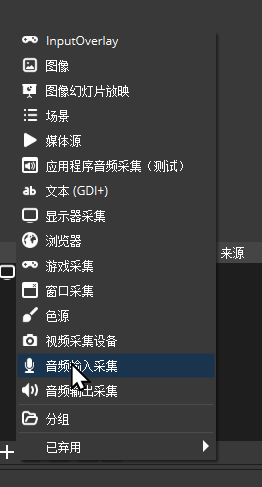

+++
title = '直播分离需要分离特定应用声轨怎么办？——虚拟声卡工具VB-CABLE使用教程'
date = 2024-09-24T15:01:46+08:00
draft = false
+++
# 前言
#### 虽然OBS有【应用程序音频采集】组件，但它只能采集有实体窗口的应用程序。
#### 那么，对于隐藏了窗口到后台的音乐播放等应用软件怎么分离音频音轨呢？
#### 本文介绍一个通用的简单解决方案。
<!--more-->
### !!注意!! 对于有实体窗口的应用程序，建议直接用OBS的【应用程序音频采集】组件，如图：

# 下载并安装VB-CABLE
* 从[官网](https://vb-audio.com/Cable/index.htm)下载最新版VB-CABLE

* 解压并安装，注意32位系统安装`VBCABLE_Setup.exe`，64位系统安装`VBCABLE_Setup_x64.exe`，一路下一步即可。
* 安装完成后，会在系统生成一个播放设备`CABLE Input`和一个录音设备`CABLE Output`，简单介绍一下工作原理就是：  
   输入`CABLE Input`的音频会被转发到`CABLE Output`

# 安装完成后检查是否正确安装
* 右键点击右下角通知栏的音频喇叭图标，弹出菜单选择`声音`
* 在`播放`选项卡中，确认`CABLE Input`设备存在

# 设置监听音频输出
* 我们必须将`CABLE Output`设备设置为监听才能从耳机/音箱中听到输入`CABLE Input`的声音
* 同样右键点击右下角通知栏的音频喇叭图标，弹出菜单选择`声音`
* 在`录制`选项卡中，找到`CABLE Ouput`设备，右键点击`属性`

* 在`属性`窗口中，切换到`侦听`选项卡，勾选和`侦听此设备`，下面的`通过此设备播放`选`默认播放设备`即可

# 设置你的应用程序输出到【CABLE Input】
* 大多数音频播放为主要功能的应用程序，以及大多数游戏都支持修改音频输出设备，我在这里举两个例子

* 网易云音乐

* foobar2000

# OBS设置
* 在OBS里添加一个音频输入设备并设置为`CABLE Output`

* 大功告成，此时你就可以对这个音频设备单独调节音轨了
